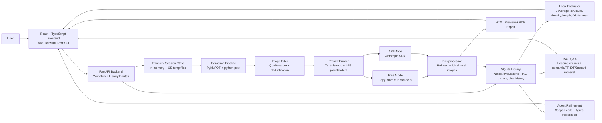

<div align="center">

# Smart Notes Generator

**A local-first study notes app that turns lecture PDFs and slides into structured notes while preserving diagrams in context.**

[](https://python.org)
[](https://fastapi.tiangolo.com)
[](https://react.dev)
[](https://typescriptlang.org)
[](LICENSE)


</div>

---

## Features

- **PDF and PowerPoint ingestion** for `.pdf`, `.pptx`, and `.ppt` lecture material.
- **Image-aware note generation** that keeps diagrams, state machines, parse trees, charts, flow diagrams, and other figures attached to the right conceptual location.
- **Local image extraction and filtering** with quality scoring, duplicate removal, and background/theme-decoration rejection.
- **Zero-token image strategy** that sends lightweight placeholders such as `{{IMG_001}}` to Claude instead of sending base64 image data or vision-model inputs.
- **Free Mode and API Mode** so the same prompt can either be copied into claude.ai manually or sent directly through the Anthropic API.
- **Automatic dropped-image fallback** that reinserts omitted image placeholders near the most relevant paragraph using context keywords.
- **Five-metric local evaluation** for generated notes: coverage, structure, key-term density, length adequacy, and faithfulness.
- **Flagged low-faithfulness sentences** to help review possible hallucinations before relying on the notes.
- **Saved notes library** stored locally in SQLite, grouped by subject and searchable from the UI.
- **Context-aware RAG Q&A** over saved notes with semantic retrieval when available and TF-IDF/Jaccard fallbacks when heavy dependencies are missing.
- **Persistent Q&A history** per saved note.
- **Agent refinement** for targeted edits after note generation, including section-specific prompt minimization and one-click undo for active sessions.
- **PDF and HTML export** with renderer fallback from WeasyPrint to xhtml2pdf to browser-printable HTML.
- **Full-page reading preview** for distraction-free review outside the main app chrome.
- **Graceful degradation** when optional ML dependencies are unavailable.
- **Local-first privacy model** where source files and extracted images stay on the user's machine.

---

## Architecture Diagram



---

## Complete Tech Stack

### Backend

| Area | Technology |
|---|---|
| Web framework | FastAPI |
| ASGI server | uvicorn |
| Request/response models | Pydantic v2 |
| File uploads | python-multipart |
| PDF text and figure extraction | PyMuPDF / pymupdf |
| PowerPoint extraction | python-pptx |
| Image analysis | Pillow |
| AI provider | Anthropic Python SDK |
| Markdown rendering | markdown |
| PDF export | WeasyPrint, xhtml2pdf, browser-printable HTML fallback |
| Evaluation and retrieval | scikit-learn, NumPy |
| Optional semantic embeddings | sentence-transformers with `all-MiniLM-L6-v2` |
| Storage | SQLite through Python's built-in `sqlite3` module |
| Runtime language | Python 3.10+ |

### Frontend

| Area | Technology |
|---|---|
| UI framework | React 18 |
| Language | TypeScript 5.6 |
| Build tool | Vite 6 |
| Styling | Tailwind CSS |
| UI primitives | Radix UI |
| Icons | lucide-react |
| Utility styling | class-variance-authority, clsx, tailwind-merge |
| Package manager | npm |

### Development Scripts

| Script | Purpose |
|---|---|
| `launch_windows.bat` | Installs dependencies, starts backend/frontend, opens the app on Windows |
| `launch_mac_linux.sh` | Installs dependencies, starts backend/frontend, opens the app on macOS/Linux |
| `frontend/npm run dev` | Starts the Vite development server |
| `frontend/npm run build` | Type-checks and builds the frontend |
| `frontend/npm run preview` | Serves the production frontend build locally |

---

## System Design and Decision Making

### 1. Local-First Processing

The project is designed around a simple privacy boundary: lecture files are processed locally, and images are never sent to an AI provider. The backend extracts text and figures into a temporary session directory, stores only generated notes in SQLite, and sends only text prompts to Claude.

This keeps the system usable for academic material that may contain private course content while also reducing token cost and latency.

### 2. Session State vs Persistent State

The app separates short-lived workflow state from saved library state.

| State type | Location | Purpose |
|---|---|---|
| Workflow sessions | In-memory dictionary in `routes/workflow.py` plus temp files under the OS temp directory | Tracks upload, extraction, image review, prompt building, generation, preview, and active-session refinement |
| Saved notes | SQLite database at `backend/data/smart_notes.db` | Stores notes, source metadata, evaluation scores, RAG chunks, PDF paths, and Q&A messages |

This keeps the active generation flow fast and simple while giving saved notes durable storage.

### 3. Placeholder-Based Diagram Preservation

Most AI note-generation systems lose diagrams because the model receives extracted text without reliable image placement. This project handles diagrams by replacing each kept figure with a stable placeholder token:

```text
{{IMG_001}}
{{IMG_002}}
{{IMG_003}}
```

Claude receives the surrounding text and placeholders, chooses where the placeholders belong in the generated Markdown, and the backend postprocessor replaces those tokens with the original local images.

The design avoids expensive vision-model calls and prevents base64 image data from bloating prompts. It also keeps images exact: diagrams are not regenerated or summarized by the model.

### 4. Extraction Pipeline

The backend extraction pipeline is intentionally split into small modules:

```text
Upload files
  -> Extract text and figures
  -> Score and filter images
  -> Assign image placeholders
  -> Build Claude prompt
  -> Generate notes
  -> Reinsert original images
  -> Save, evaluate, export, or refine
```

Key extraction decisions:

- **PyMuPDF is used directly** for PDF processing to avoid ONNX/runtime issues from heavier PDF helper stacks.
- **Raster and vector figures are both considered.** PDF raster image blocks are extracted, and vector drawings are clustered by bounding boxes and rendered as figure images.
- **Text-dominated regions are rejected** so full text slides do not become useless "figures."
- **Beamer overlay pages are deduplicated** using approximate text similarity, which reduces repeated slide fragments.
- **PPTX speaker notes are included** because lecturer notes often contain the explanatory context missing from slide bullets.
- **Grouped PowerPoint images are handled** so diagrams inside grouped shapes are still extracted.

### 5. Image Quality Scoring

Extracted images are not trusted blindly. Each candidate image receives a composite score based on:

- Pixel dimensions
- Aspect ratio
- File size
- Color entropy
- Non-blankness
- Content hash deduplication

The default threshold is `0.35`, which keeps meaningful diagrams while filtering logos, blank backgrounds, decorative frames, thin banners, and repeated assets. Users can still review and toggle images before generation.

### 6. Dual Generation Modes

The app supports two generation paths with the same prompt format:

| Mode | Design reason |
|---|---|
| Free Mode | Lets users use claude.ai manually without storing API keys or paying API costs |
| API Mode | Automates generation through the Anthropic API when a key is provided |

Because both paths use the same prompt builder and postprocessor, the rest of the workflow remains identical.

### 7. Postprocessing and Fallback Reinsertion

The postprocessor replaces placeholders with local image figures after Claude returns Markdown. If Claude drops a placeholder, the fallback reinsertion logic uses the image's nearby extracted context and keywords to place the image near the most relevant paragraph.

This decision makes the image workflow resilient to normal LLM formatting mistakes without requiring another model call.

### 8. Evaluation Without Another AI Call

Generated notes can be evaluated locally. The evaluator avoids calling Claude again and instead uses deterministic or local ML methods:

| Metric | Purpose |
|---|---|
| Coverage | Checks whether source key terms appear in the notes |
| Structure | Checks for expected study-note formatting such as headings, tables, summaries, code blocks, and exam sections |
| Key-term density | Measures whether important terms are emphasized at a useful rate |
| Length adequacy | Compares generated length against source length |
| Faithfulness | Compares note sentences against source text and flags weakly supported sentences |

When `sentence-transformers` is installed, semantic similarity is used. Otherwise the app falls back to TF-IDF or Jaccard overlap.

### 9. RAG Design

Saved notes are split at `##` heading boundaries and stored as RAG chunks. During Q&A, the app retrieves the top matching chunks and builds a grounded prompt that instructs Claude to answer only from those excerpts.

Retrieval follows a fallback ladder:

1. Sentence-transformer embeddings when available.
2. TF-IDF cosine similarity when scikit-learn is available.
3. Jaccard keyword overlap as a final dependency-light fallback.

Figures are stripped from RAG chunks so base64/HTML image content does not pollute retrieval.

### 10. Refinement Design

Agent refinement is built around scoped editing rather than whole-document rewriting by default.

The backend scans note headings and the user's request. If the request mentions a specific section, only that section is sent for modification. If no specific section can be detected, the full note is sent. Existing figures are replaced with temporary `{{REFINE_IMG_NNN}}` tokens before prompting and restored afterward.

This reduces prompt size, preserves diagrams, and lowers the chance of unrelated edits.

### 11. Export Strategy

PDF export is implemented with progressive fallback:

1. Render Markdown HTML to PDF with WeasyPrint.
2. Fall back to xhtml2pdf if WeasyPrint is unavailable.
3. Fall back to HTML that can be opened and printed to PDF in the browser.

This is especially useful on Windows, where WeasyPrint may require additional GTK dependencies.

---

## Project Setup

### Prerequisites

| Requirement | Version | Notes |
|---|---|---|
| Python | 3.10 or later | Required for the FastAPI backend |
| Node.js | 18 or later | Required for the React/Vite frontend |
| npm | 9 or later | Bundled with most Node.js installers |
| claude.ai account | Optional | Needed for Free Mode generation |
| Anthropic API key | Optional | Needed for API Mode generation |

### Clone the Repository

```bash
git clone https://github.com/YOUR_USERNAME/smart-notes-generator.git
cd smart-notes-generator
```

If you are setting up from an existing local copy, open a terminal in the project root:

```bash
cd smart_notes
```

### One-Command Setup

The launch scripts install dependencies and start both servers.

Windows:

```bat
launch_windows.bat
```

macOS/Linux:

```bash
chmod +x launch_mac_linux.sh
./launch_mac_linux.sh
```

After startup, open:

```text
http://localhost:5173
```

The backend API runs at:

```text
http://127.0.0.1:8000
```

FastAPI docs are available at:

```text
http://127.0.0.1:8000/docs
```

### Manual Setup

Use two terminals.

Terminal 1 - backend:

```bash
cd backend
pip install -r requirements.txt
uvicorn main:app --host 127.0.0.1 --port 8000 --reload
```

Terminal 2 - frontend:

```bash
cd frontend
npm install
npm run dev
```

Open the app at:

```text
http://localhost:5173
```

### Optional Semantic Retrieval Setup

Install this only if you want better semantic faithfulness scoring and RAG retrieval:

```bash
pip install sentence-transformers
```

The first semantic run downloads `all-MiniLM-L6-v2`. Without this package, the app automatically falls back to TF-IDF or Jaccard similarity.

### Windows PDF Export Note

WeasyPrint may require GTK on Windows. If PDF export fails with a `libgobject` or GTK-related error, install the fallback renderer:

```bash
pip install xhtml2pdf
```

The app can also return HTML that can be printed to PDF from the browser.

---

## Project Structure

```text
smart_notes/
|-- backend/
|   |-- main.py                  FastAPI app, CORS, router registration
|   |-- database.py              SQLite schema and connection helper
|   |-- models.py                Pydantic request/response schemas
|   |-- routes/
|   |   |-- workflow.py          Upload, extraction, generation, preview, export, active refinement
|   |   `-- library.py           Saved notes, evaluation, RAG, chat history, saved-note refinement
|   |-- services/
|   |   |-- evaluator.py         Local five-metric note evaluation
|   |   `-- rag_service.py       Chunking, retrieval, RAG prompt assembly
|   `-- core/
|       |-- extractor.py         PDF/PPT/PPTX text and figure extraction
|       |-- image_filter.py      Image scoring, filtering, deduplication, placeholder IDs
|       |-- prompt_builder.py    Source cleanup, token estimate, Claude prompt construction
|       |-- postprocessor.py     Image injection, fallback placement, refine figure restoration
|       `-- pdf_renderer.py      Markdown preview and PDF/HTML export
|-- frontend/
|   |-- src/
|   |   |-- App.tsx              Root layout and app-level view routing
|   |   |-- api/client.ts        Typed fetch wrappers for backend endpoints
|   |   |-- types/index.ts       Shared TypeScript interfaces
|   |   |-- lib/utils.ts         UI utility helpers
|   |   `-- components/
|   |       |-- layout/           Sidebar and navigation surfaces
|   |       |-- workflow/         Upload, extraction, image review, generation, export, refinement
|   |       |-- library/          Saved-note grid and note viewer
|   |       |-- rag/              Note-grounded Q&A UI
|   |       `-- ui/               Shared UI primitives
|   |-- package.json
|   `-- vite.config.ts
|-- screenshots/
|-- launch_windows.bat
|-- launch_mac_linux.sh
|-- LICENSE
`-- README.md
```

---

## Environment and Data Notes

- Temporary workflow files are created under the operating system temp directory in `smart_notes_sessions`.
- Saved notes are stored in `backend/data/smart_notes.db`.
- API keys are entered at runtime and are not required for Free Mode.
- Images are extracted and served locally from session directories.
- RAG chunks strip figure HTML before storage to keep retrieval focused on note text.

---

## License

MIT License - see [LICENSE](LICENSE) for details.

---

<div align="center">

Built for local study workflows. Source files stay local. Images are never sent to the AI provider.

</div>
