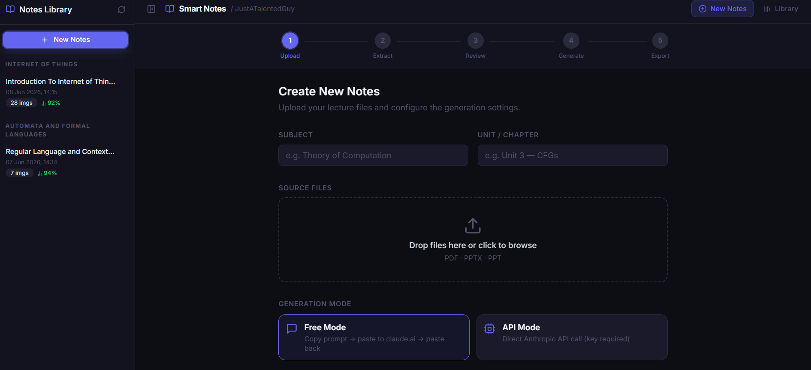
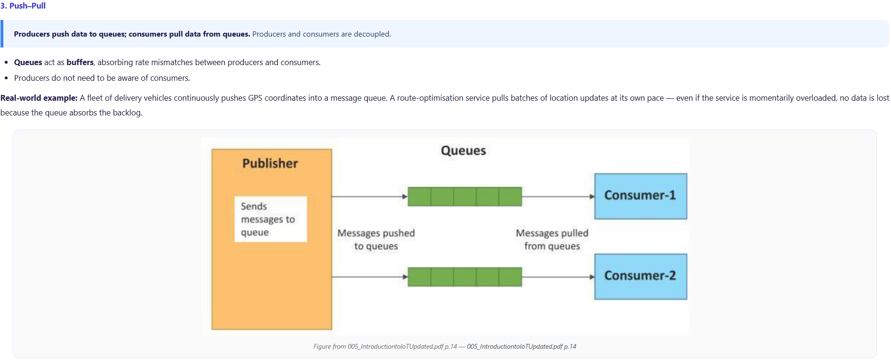
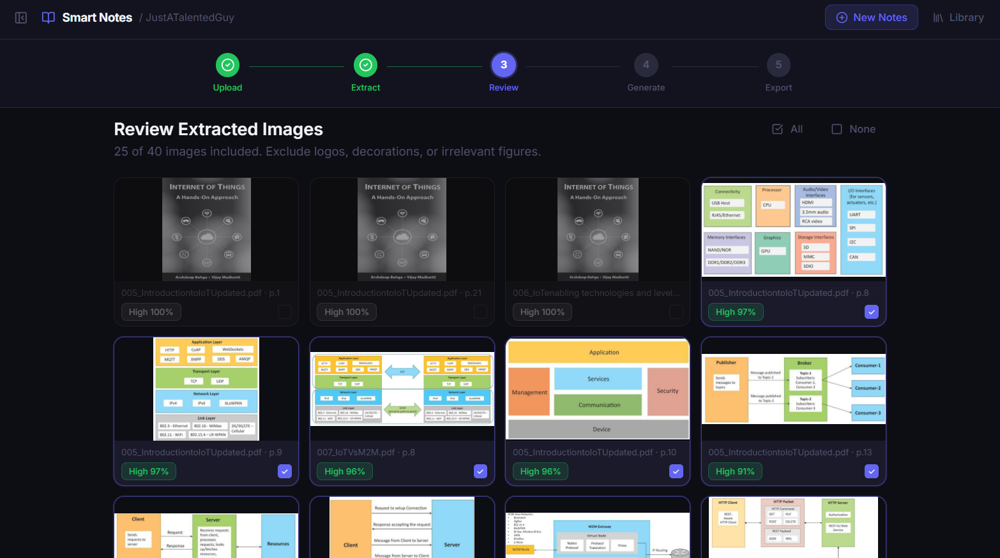
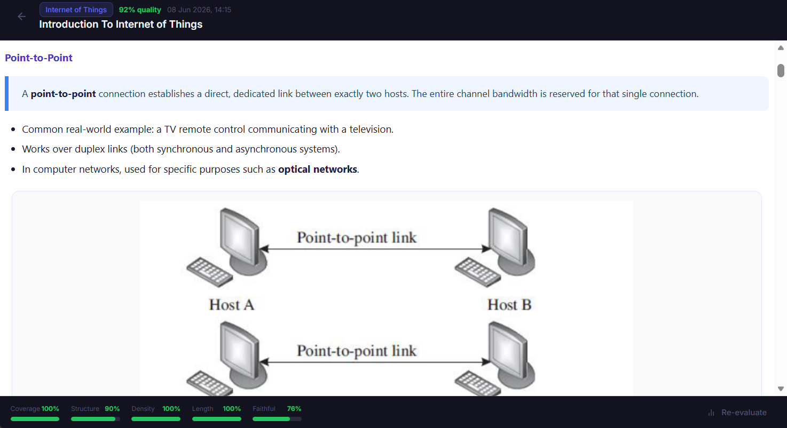
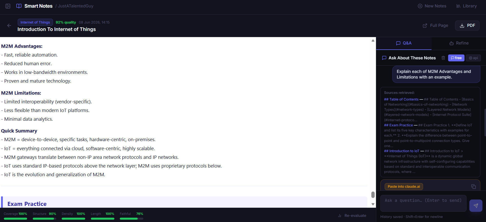
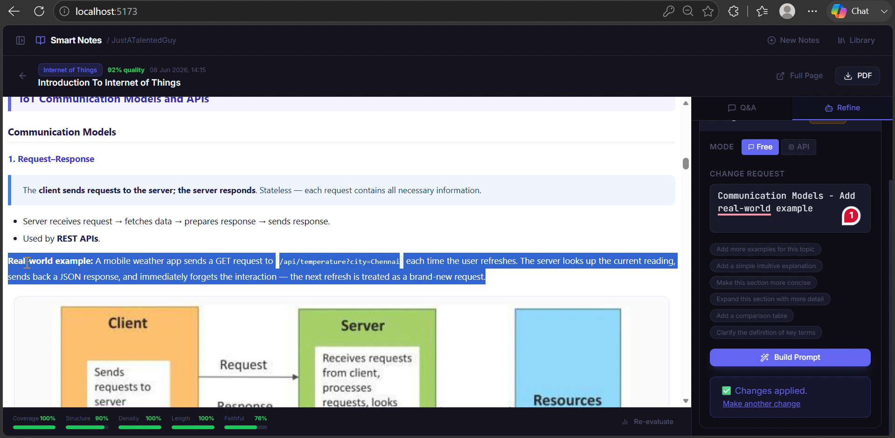
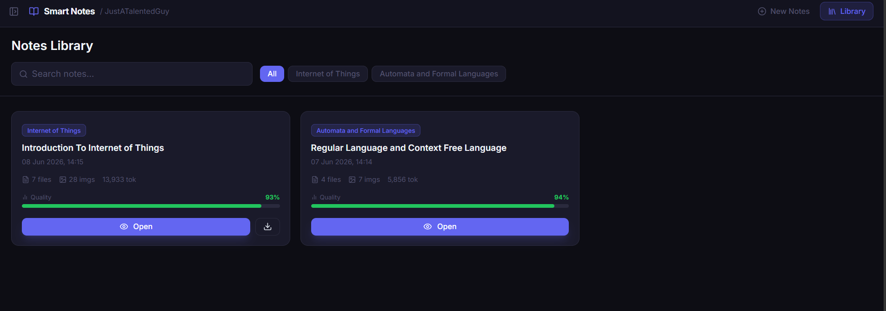

<div align="center">

# 📚 Smart Notes Generator

**Turn your lecture PDFs and slides into comprehensive, exam-ready study notes — with diagrams included in the right places.**

[](https://python.org)
[](https://fastapi.tiangolo.com)
[](https://react.dev)
[](https://typescriptlang.org)
[](LICENSE)



</div>

---

## The Problem This Solves

When you upload lecture notes to an AI and ask for enhanced study notes,
diagrams are silently dropped. The AI returns text-only output. You then have to
keep the AI notes and the original files open side-by-side — which defeats the
purpose.

This tool solves that by extracting diagrams locally, replacing them with short
placeholder tokens (`{{IMG_001}}`), sending only *text* to Claude, and then
re-inserting the original images at exactly the positions Claude chose.

**Result:** One complete, readable notes document with all diagrams in context —
no split attention, no missing figures.

---

## Key Features

### 🖼️ Image-Aware Notes Generation

Diagrams, parse trees, state machines, flowcharts, and circuit diagrams from
your source files appear inside the generated notes at contextually appropriate
positions — not dumped at the end, not missing entirely.



**How it works:**
Images are extracted locally. Each is replaced by a compact token (`{{IMG_001}}`).
Claude receives only text — no image data — and decides where each token belongs
based on surrounding content. Post-processing replaces tokens with the actual
embedded images.

---

### 📉 Zero-Token Image Handling

Sending academic diagrams to a vision model is wasteful. Their meaning comes from
the surrounding text, not from what Claude would "see" in the pixels. Each image
sent as vision input costs 1,000–4,000 tokens and is largely ignored by the model.
The placeholder approach costs ~2 tokens per image and achieves the same
positional result.

---

### 🔀 Two Modes — Always Available

Every feature supports both generation modes:

| Mode | How it works | Cost |
|---|---|---|
| **Free Mode** | Builds a copy-paste prompt. You paste into [claude.ai](https://claude.ai), paste the response back. | Zero cost — uses your existing account |
| **API Mode** | Calls the Anthropic API directly. Fully automated. | Per-token billing |

Switch between modes at any step. The prompt built for Free Mode is identical
to what API Mode sends programmatically.

---

### 🔍 Smart Image Filtering

Not every image in a lecture PDF is a useful diagram. Logos, decorative borders,
blank slide backgrounds, and navigation icons are automatically removed using a
five-factor quality scoring system:

- **Pixel dimensions** — larger images carry more visual information
- **Aspect ratio** — thin banners and header/footer decorations are penalised
- **File size** — more bytes means more detail content
- **Colour entropy** — blank white images score near zero
- **Non-blankness** — quadratic penalty for mostly-white images

Content-identical images across multiple files are deduplicated via MD5 hash.
A background detection filter removes Beamer theme decorations (header bars,
full-page fills) that would otherwise be extracted as "figures".



---

### 📊 Five-Metric Local Evaluation

Every set of generated notes can be scored automatically — zero API calls,
zero internet required, everything runs on your machine.

| Metric | What it measures | Method |
|---|---|---|
| **Coverage** | % of source key-terms present in the notes | TF-IDF vocabulary overlap |
| **Structure** | Headings, tables, code blocks, summary, exam section | Regex heuristics (10 checks) |
| **Key-Term Density** | Bold terms and code spans per 100 words | Count ratio |
| **Length Adequacy** | Notes length vs source length (ideal: 0.6–1.8×) | Word count ratio |
| **Faithfulness** | How well notes sentences trace back to the source | Semantic / Jaccard similarity |

Low-faithfulness sentences are individually flagged so you can review any
potentially hallucinated content before using the notes for revision.



---

### 💬 Context-Aware RAG Q&A

After saving notes to your library, you can ask questions in natural language
and get answers grounded in *your own notes* — not hallucinated from general knowledge.

**How it works:**
Notes are split at `##` heading boundaries into semantic chunks. Each question
is matched against chunks using semantic similarity (sentence-transformers if
installed, TF-IDF otherwise, Jaccard as a final fallback). The top-3 most
relevant chunks are included in the prompt, with source section citations in
the answer.

Chat history persists in SQLite — your conversation is there the next time
you open the note.



---

### 🪄 Agent Refinement

After notes are generated, an AI agent can make targeted surgical edits based
on plain-English instructions.

**Example prompts:**
- *"Add more examples for Context Free Grammars"*
- *"Add a simple intuitive explanation for the pumping lemma"*
- *"Make the TCP section more concise"*
- *"Add a comparison table for DFA vs NFA"*

The agent automatically detects whether your request is **section-specific**
(only that section is sent to Claude — typically 40–100 tokens) or
**document-wide** (the full notes are sent). Either way, base64 images are
stripped from the prompt and restored afterward — typically an 80–88% reduction
in prompt size. Undo is supported with one click.



---

### 📖 Notes Library

All saved notes are stored locally in SQLite, organised by subject with
search and filtering. Quality scores are visible at a glance in the card grid.



---

### 🪟 Distraction-Free Reading

A **Full Page** button opens your notes in a clean browser tab — just the notes,
no sidebars, no app UI. Styled with academic typography, proper heading hierarchy,
and tables optimised for scanning.

The sidebar can also be collapsed at any time to give the notes preview more space.

---

### 🔄 Graceful Degradation

The app is fully usable with or without optional heavy dependencies:

| Feature | With all deps | With required deps only |
|---|---|---|
| Evaluation — Coverage | TF-IDF (precise) | Jaccard word overlap |
| Evaluation — Faithfulness | Semantic embeddings | Jaccard sentence overlap |
| RAG retrieval | Dense vector similarity | Keyword overlap |
| PDF export | WeasyPrint → xhtml2pdf → HTML for browser print |

---

## Supported Input Formats

| Format | Notes |
|---|---|
| `.pdf` | Native text PDFs, LaTeX/Beamer slides, PPT-exported PDFs |
| `.pptx` | Native PowerPoint — speaker notes included |
| `.ppt` | Legacy PowerPoint |

Works best with text-selectable PDFs. Scanned PDFs will extract minimal text
but will still capture any embedded raster images.

---

## Tech Stack

| Layer | Technology |
|---|---|
| Backend framework | FastAPI + uvicorn |
| PDF processing | pymupdf (direct — no ONNX dependency) |
| Slide processing | python-pptx |
| Image analysis | Pillow |
| AI model | Anthropic Claude (`claude-sonnet-4`) |
| Evaluation / RAG | scikit-learn, sentence-transformers, NumPy (all optional) |
| PDF rendering | WeasyPrint → xhtml2pdf → browser fallback |
| Database | SQLite (built-in Python module, no setup) |
| Frontend | React 18, TypeScript, Vite |
| Styling | Tailwind CSS |
| UI primitives | Radix UI + custom components |
| Icons | lucide-react |

---

## Prerequisites

| Requirement | Version | Download |
|---|---|---|
| Python | 3.10 or later | [python.org](https://www.python.org/downloads/) |
| Node.js | 18 or later | [nodejs.org](https://nodejs.org/) |
| npm | 9 or later | Bundled with Node.js |
| claude.ai account | Free tier | [claude.ai](https://claude.ai) |
| Anthropic API key | Optional (API mode) | [console.anthropic.com](https://console.anthropic.com/) |

---

## Installation and Setup

### 1. Clone the repository

```bash
git clone https://github.com/YOUR_USERNAME/smart-notes-generator.git
cd smart-notes-generator
```

### 2. Launch (one command)

**macOS / Linux:**
```bash
chmod +x launch_mac_linux.sh
./launch_mac_linux.sh
```

**Windows:**
```
launch_windows.bat
```

The launcher installs all dependencies, starts both servers, and opens the app
in your browser at **http://localhost:5173**.

---

### Manual Setup (two terminals)

**Terminal 1 — Backend:**
```bash
cd backend
pip install -r requirements.txt
uvicorn main:app --host 127.0.0.1 --port 8000 --reload
```

**Terminal 2 — Frontend:**
```bash
cd frontend
npm install
npm run dev
```

Backend API docs: [http://127.0.0.1:8000/docs](http://127.0.0.1:8000/docs)

---

### Optional: Better Evaluation and RAG

```bash
pip install sentence-transformers
```

Downloads `all-MiniLM-L6-v2` (~80 MB) on first use. Runs locally on CPU.
Provides semantic similarity for both evaluation faithfulness scoring and
RAG chunk retrieval. Without it, TF-IDF or Jaccard fallbacks are used automatically.

---

### Windows: PDF Export

WeasyPrint (the primary PDF renderer) requires GTK on Windows. If you see a
`libgobject` error, the app automatically falls back to `xhtml2pdf`:

```bash
pip install xhtml2pdf
```

For full WeasyPrint support on Windows:
[WeasyPrint Windows guide](https://doc.courtbouillon.org/weasyprint/stable/first_steps.html#windows)

---

## Usage Guide

### Step 1 — Upload

1. Enter the **Subject** and **Unit / Chapter** name — these appear in the
   generated notes heading
2. Drag and drop your PDF and PPTX files (or click to browse)
3. Choose **Free Mode** (copy-paste) or **API Mode** (automated)
4. Adjust the image quality threshold if needed — 0.35 is a good default

> **Tip:** Upload all files for a single unit together. The AI synthesises them
> into one unified document, resolving overlaps and connecting related content
> across files automatically.

---

### Step 2 — Extract

The app processes your files in the background. Watch the live log to see
what's being extracted. The token estimate at the bottom tells you whether
your content fits comfortably within the model's context window.

> **Tip:** If the token warning shows amber or red, consider splitting across
> two sessions — for example, upload lectures 1–3 in one session and 4–5 in
> another.

---

### Step 3 — Review Images

Every extracted image is displayed with a quality score badge. Untick images
you want to exclude — logos, cover slides, decorative borders.

> **Tip:** Images extracted from text-heavy slides typically have low quality
> scores and are filtered out automatically. Scan the gallery quickly and look
> for anything that clearly isn't a content diagram.

---

### Step 4 — Generate

**Free Mode:**
1. Click **Build Prompt**
2. Click **Copy Prompt** and paste into [claude.ai](https://claude.ai)
3. Wait for Claude to respond (30–90 seconds for a full unit)
4. Select all of Claude's response → copy → paste into **Paste Response**
5. Click **Process Response**

**API Mode:**
1. Enter your Anthropic API key
2. Click **Generate via API** — done automatically

> **Tip (Free Mode):** Do not edit Claude's response before pasting it back.
> The `{{IMG_NNN}}` placeholder tokens must survive intact for images to be
> reinserted correctly.

> **Tip:** The **"Auto-position images Claude drops"** toggle (on by default)
> catches any placeholder tokens Claude omits and inserts the image near the
> most semantically relevant paragraph using keyword matching.

---

### Step 5 — Export and Evaluate

1. Click **Save to Library** — this persists the note and builds RAG chunks
2. Click **Run Evaluation** to score the notes on five metrics
3. Review the flagged sentences for any potentially hallucinated content
4. Export as PDF, or click **Full Page** and use browser print (Ctrl+P → Save as PDF)

> **Tip:** Run evaluation after every session. The structural check breakdown
> tells you exactly which formatting elements are missing — if "has_exam" is
> unchecked, Claude may have truncated the Exam Practice section.

---

### Agent Refinement

After notes are generated (Step 5) or when viewing a saved note in the Library,
open the **Agent Refinement** panel:

1. Type your change request in plain English
2. The scope is auto-detected: section-specific or whole-document
3. Click **Build Prompt** (Free Mode) or **Refine via API** (API Mode)
4. For Free Mode: copy the prompt → paste into claude.ai → paste response back → click **Apply**
5. The preview reloads automatically

> **Tip:** Mention the section name explicitly to ensure local scope detection:
> *"Add more examples for the **pumping lemma** section"* rather than just
> *"Add more examples"*. Local scope sends ~50 tokens instead of the full document.

> **Tip:** Use the **Undo** button if you don't like the result. You can always
> undo the last refinement with one click.

---

### RAG Q&A

Open any saved note from the Library → click the **Q&A** tab in the right panel:

```
"What is the difference between DFA and NFA?"
"Give an example of a CFG that generates balanced parentheses"
"Why does the pumping lemma prove a language is not regular?"
```

In **Free Mode**, a ready-to-paste prompt is generated with the retrieved
note excerpts included. In **API Mode**, Claude answers directly.

> **Tip:** The Q&A is grounded in *your notes*, not Claude's general knowledge.
> If your notes don't cover the question, the response says so — which is more
> useful than a confident hallucinated answer.

---

## Project Structure

```
smart_notes_v2/
├── backend/
│   ├── main.py               FastAPI app, CORS, router registration
│   ├── database.py           SQLite schema and connection helper
│   ├── models.py             Pydantic request/response schemas
│   ├── routes/
│   │   ├── workflow.py       Session lifecycle: upload → extract → generate → refine
│   │   └── library.py       Notes library: save, evaluate, RAG, refine, chat history
│   ├── services/
│   │   ├── evaluator.py      Five-metric local quality evaluation
│   │   └── rag_service.py    Semantic chunking, retrieval, prompt assembly
│   └── core/                 ← Core processing pipeline
│       ├── extractor.py      PDF/PPTX text and figure extraction (pymupdf direct)
│       ├── image_filter.py   Five-factor quality scoring and MD5 deduplication
│       ├── prompt_builder.py {{IMG_NNN}} placeholder injection and prompt construction
│       ├── postprocessor.py  Image reinsertion; strip/restore cycle for refine
│       └── pdf_renderer.py   Markdown → HTML; WeasyPrint / xhtml2pdf / HTML fallback
├── frontend/
│   └── src/
│       ├── App.tsx                    Root layout, view routing, sidebar toggle state
│       ├── api/client.ts              Typed fetch wrappers for all backend endpoints
│       ├── types/index.ts             Shared TypeScript interfaces
│       ├── lib/utils.ts               cn(), scoreColor(), formatDate()
│       └── components/
│           ├── ui/primitives.tsx      Button, Badge, Card, Input, Alert, Spinner, …
│           ├── layout/Sidebar.tsx     Notes library list, grouped by subject
│           ├── workflow/
│           │   ├── WorkflowPage.tsx   Stepper shell + WorkflowState owner
│           │   ├── AgentPanel.tsx     Shared agent refinement UI
│           │   └── steps/             UploadStep · ExtractStep · ReviewImagesStep
│           │                          GenerateStep · ExportStep
│           ├── library/
│           │   ├── LibraryPage.tsx    Searchable, filterable notes grid
│           │   └── NoteViewer.tsx     iframe preview + Q&A + Refine tabs
│           └── rag/
│               └── RagChat.tsx        Context-aware Q&A with persistent history
├── launch_windows.bat
└── launch_mac_linux.sh
```

---

## Privacy

All file processing happens locally on your machine.

The only data that leaves your machine:
- **Free Mode:** The text prompt you manually paste into claude.ai
- **API Mode:** The text prompt sent to Anthropic's API

**Images are never transmitted.** Base64 image data is stripped from every
prompt before sending. Your lecture files stay on your machine.

---

## Troubleshooting

**Images not showing in the Review step**

The backend searches for images in `session_dir/imgs/` and `session_dir/raw_images/`
automatically. If thumbnails still show a broken icon, check the extraction log
for errors on that specific file.

**ONNXRuntimeError during extraction**

This was caused by `pymupdf4llm` which depends on `magika` (an ONNX-based
file classifier). The current version uses `pymupdf` directly with no ONNX
dependency. Run `pip install --upgrade pymupdf` if errors persist.

**sklearn / NumPy ABI error in terminal**

If you see `A module compiled using NumPy 1.x cannot be run in NumPy 2.x`
in the terminal (common on Anaconda), the app handles this automatically.
Evaluation and RAG fall back to Jaccard similarity with no loss of app
functionality. The terminal warning can be silenced by upgrading sklearn:

```bash
pip install --upgrade scikit-learn
```

**PDF export fails with `libgobject` error (Windows)**

Install `xhtml2pdf` as an alternative renderer:
```bash
pip install xhtml2pdf
```

**Token estimate shows a red warning**

Your combined file content is large. Either switch to API Mode (handles up to
200K tokens) or split across two sessions — upload 2–3 files per session and
save them separately to the library.

**Preview iframe shows "Session not found"**

The backend session store is in-memory and resets if the backend server restarts.
Go back to Step 1 and run a new extraction — previously saved notes in the
Library are unaffected (they are in SQLite).

---

## Contributing

Contributions are welcome. Some areas that would benefit from work:

- **OCR support** for scanned PDFs (Tesseract integration)
- **DOCX support** via python-docx
- **Anki flashcard export** from generated notes
- **LangGraph pipeline** refactor for explicit agentic state management
- **Evaluation history chart** showing quality trends across revision sessions
- **Chunk overlap** strategy for RAG (currently splits at `##` boundaries only)

Please open an issue before submitting a large pull request.

---

## License

MIT License — see [LICENSE](LICENSE) for details.

---

<div align="center">

Built as a project for personal use &nbsp;·&nbsp;
All processing is local &nbsp;·&nbsp;
Images never leave your machine

</div>